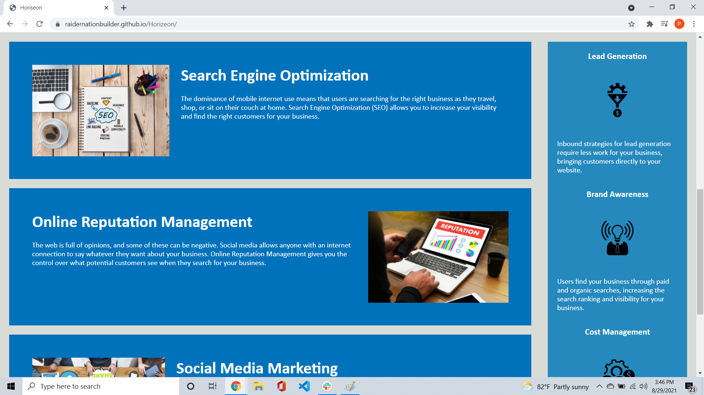
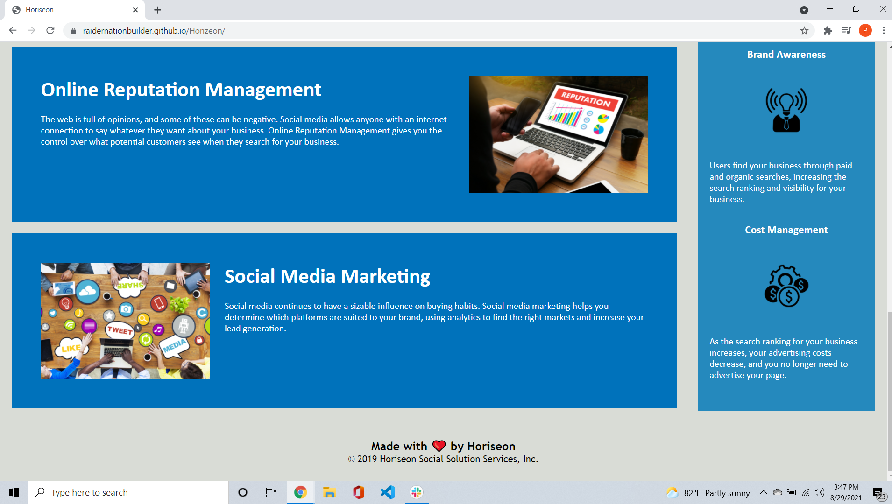

# Code Refactor Starter Code
Discription: A marketing agency wanted their website modified for accessability and search engine optimization. They want the elements to follow a logical structure, alt attributes added to image tags, sequential heading attributes, and a concise descriptive title.

Link to deployed url: https://raidernationbuilder.github.io/Horizeon/

Screenshots :

